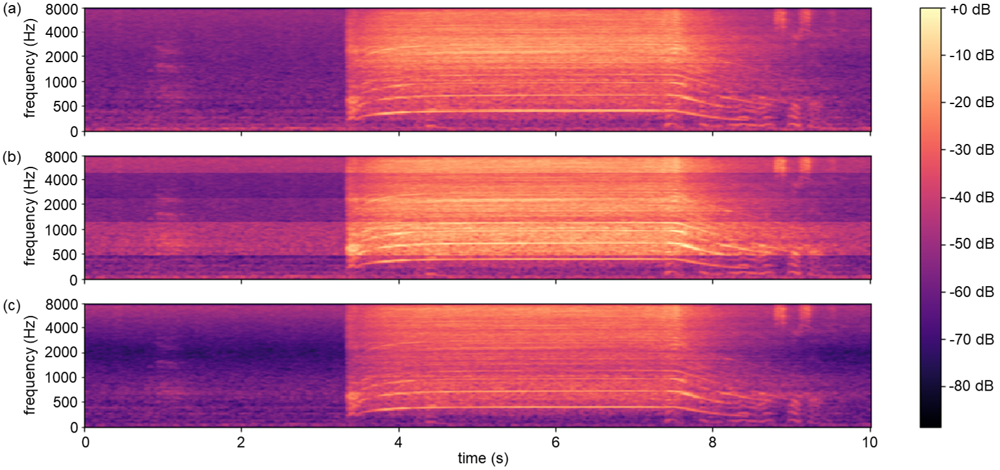

# Sound Event Detection with FilterAugment

Official implementation of <br>
 - **Heavily Augmented Sound Event Detection utilizing Weak Predictions** (DCASE2021 Challenge Task 4 technical report) <br>
by Hyeonuk Nam, Byeong-Yun Ko, Gyeong-Tae Lee, Seong-Hu Kim, Won-Ho Jung, Sang-Min Choi, Yong-Hwa Park <br>
[](http://dcase.community/documents/challenge2021/technical_reports/DCASE2021_Nam_41_t4.pdf) 
[](https://arxiv.org/abs/2107.03649)<br>
       - arXiv version has updates on some minor errors
 - **FilterAugment: An Acoustic Environmental Data Augmentation Method** (Accepted to ICASSP 2022) <br>
by Hyeonuk Nam, Seong-Hu Kim, Yong-Hwa Park <br>
[](https://ieeexplore.ieee.org/document/9747680) 
[](https://arxiv.org/abs/2110.03282) <br>

Ranked on **[3rd place]** in [IEEE DCASE 2021 Task 4](http://dcase.community/challenge2021/task-sound-event-detection-and-separation-in-domestic-environments-results), and accepted to [ICASSP 2022](https://2022.ieeeicassp.org/).c

Also, refer to [Frequency Dynamic Convolution SED](https://github.com/frednam93/FDY-SED) which is upgraded SED model from this work!

## FilterAugment
Filter Augment is an audio data augmentation method newly proposed on the above papers for training acoustic models in audio/speech tasks. It applies random weights on randomly selected frequency bands. For more details, refer to the papers mentioned above.<br>
<br>
- This example shows two types of FilterAugment applied on log mel spectrogram of a 10-second audio clip. (a) shows original log mel spectrogram, (b) shows log mel spectrogram applied by step type FilterAugment (c) shows log mel spectrogram applied by linear type Filter Augment.
- Applied filters are shown below. Filter (d) is applied on (a) to result in (b), and filter (e) is applied on (a) to result in (c)

 <br> <br> <br> <br> <br> <br> <br> <br> <br> <br>

- Step type FilterAugment shows several frequency bands that are uniformly increased or decreased in amplitude, while linear type FilterAugment shows continous filter that shows certain peaks and dips.
- On our participation on [DCASE2021 challenge task 4](https://arxiv.org/abs/2107.03649), we used prototype FilterAugment which is step type FilterAugment without hyperparameter *minimum bandwith*. The code for this prototype is defiend as "filt_aug_prototype" at [utils/data_aug.py](./utils/data_aug.py) @ line 107
- Code for updated FilterAugment including step and linear type for [ICASSP submission](https://arxiv.org/abs/2110.03282) is defiend as "filt_aug" at [utils/data_aug.py](./utils/data_aug.py) @ line 126


## Requirements
Python version of 3.7.10 is used with following libraries
- pytorch==1.8.0
- pytorch-lightning==1.2.4
- pytorchaudio==0.8.0
- scipy==1.4.1
- pandas==1.1.3
- numpy==1.19.2


other requrements in [requirements.txt](./requirements.txt)


## Datasets
You can download datasets by reffering to [DCASE 2021 Task 4 description page](http://dcase.community/challenge2021/task-sound-event-detection-and-separation-in-domestic-environments) or [DCASE 2021 Task 4 baseline](https://github.com/DCASE-REPO/DESED_task). Then, set the dataset directories in [config yaml files](./configs/) accordingly. You need DESED real datasets (weak/unlabeled in domain/validation/public eval) and DESED synthetic datasets (train/validation).

## Training
You can train and save model in `exps` folder by running:
```shell
python main.py
```

#### model settings:
There are 5 configuration files in this repo. Default setting is optimized linear FilterAugment with [ICASSP setting](./configs/config_icassp.yaml) described in [paper submitted to ICASSP](https://arxiv.org/abs/2107.03649). There are 4 other model settings from [DCASE tech report](https://arxiv.org/abs/2107.03649) with prototype FilterAugment. To train for model [1](./configs/config_dcase_model1.yaml), [2](./configs/config_dcase_model2.yaml), [3](./configs/config_dcase_model3.yaml) or [4](./configs/config_dcase_model4.yaml) from the DCASE tech report, you can run the following code instead.
```shell
# for example, to train model 3:
python main.py --confing dcase_model3
```

#### Results of prototype FilterAugment with [DCASE settings (model 1~4)](https://arxiv.org/abs/2107.03649) on DESED Real Validation dataset:

Model                                                                    | PSDS1          | PSDS2          | Collar-based F1
-------------------------------------------------------------------------|----------------|----------------|-----------------
[DCASE2021 Task4 baseline](https://github.com/DCASE-REPO/DESED_task)     | 0.353          | 0.553          | 42.1%
proto-FiltAug model 1                                                    | 0.408          | 0.628          | 49.0%
proto-FiltAug model 2                                                    | **0.414**      | 0.608          | 49.2%
proto-FiltAug model 3                                                    | 0.381          | 0.660          | 31.8%
proto-FiltAug model 4                                                    | 0.052          | **0.783**      | 19.8%

   - These results are based on train models with single run for each setting


#### Results of updated FilterAugment with [ICASSP settings](https://arxiv.org/abs/2107.03649) on DESED Real Validation dataset:

Model                   | PSDS1          | PSDS2          | Collar-based F1  | Intersection-based F1
------------------------|----------------|----------------|------------------|-----------------
w/o FiltAug             | 0.387          | 0.598          | 47.7%            | 70.8%
optimized step FiltAug  | 0.412          | 0.634          | 47.4%            | 71.2%
optimized linear FiltAug| **0.413**      | **0.636**      | **49.0%**        | **73.5%**

   - These results are based on max values of each metric for 3 separate runs on each setting (refer to paper for details).


## Reference
[DCASE 2021 Task 4 baseline](https://github.com/DCASE-REPO/DESED_task)

## Citation & Contact
If this repository helped your works, please cite papers below!
```bib
@techreport{Nam2021,
    Author = "Nam, Hyeonuk and Ko, Byeong-Yun and Lee, Gyeong-Tae and Kim, Seong-Hu and Jung, Won-Ho and Choi, Sang-Min and Park, Yong-Hwa",
    title = "Heavily Augmented Sound Event Detection utilizing Weak Predictions",
    institution = "DCASE2021 Challenge",
    year = "2021",
    month = "June",
}

@INPROCEEDINGS{nam2021filteraugment,
    author={Nam, Hyeonuk and Kim, Seong-Hu and Park, Yong-Hwa},
    booktitle={ICASSP 2022 - 2022 IEEE International Conference on Acoustics, Speech and Signal Processing (ICASSP)}, 
    title={Filteraugment: An Acoustic Environmental Data Augmentation Method}, 
    year={2022},
    pages={4308-4312},
    doi={10.1109/ICASSP43922.2022.9747680}
}

```
Please contact Hyeonuk Nam at frednam@kaist.ac.kr for any query.

