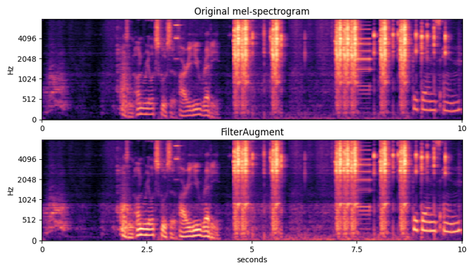

# Sound Event Detection with FilterAugment

Official implementation of **Heavily Augmented Sound Event Detection utilizing Weak Predictions**<br>
by Hyeonuk Nam, Byeong-Yun Ko, Gyeong-Tae Lee, Seong-Hu Kim, Won-Ho Jung, Sang-Min Choi, Yong-Hwa Park @ [Human Lab](http://human.kaist.ac.kr/), Mechanical Engineering Department, KAIST

[](https://arxiv.org/abs/2107.03649)
[](http://dcase.community/documents/challenge2021/technical_reports/DCASE2021_Nam_41_t4.pdf)


Ranked on **[3rd place]** in [IEEE DCASE 2021 Task 4](http://dcase.community/challenge2021/task-sound-event-detection-and-separation-in-domestic-environments-results).

## FilterAugment
Filter Augment is a data augmentation method newly proposed on the above paper, for audio/speech representation learning. It randomly divides frequency domain into several bands, and then apply different amplitude amplification/reduction on each band. For more detail, refer to the paper mentioned above.<br>
<br>
- This example shows FilterAugment applied on log-mel spectrogram of a 10-second audio clip. There are 3 frequency bands, and the low-frequency band(0 ~ 1kHz) is amplified, mid-frequency band(1 ~ 2.5kHz)is diminished while high-frequency band(2.5 ~ 8kHz) is just slightly diminished.

## Requirements
Python version of 3.7.10 is used with following libraries
- pytorch==1.8.0
- pytorch-lightning==1.2.4
- pytorchaudio==0.8.0
- scipy==1.4.1
- pandas==1.1.3
- numpy==1.19.2
- other requrements in [requirements.txt](./requirements.txt)


## Datasets
You can download datasets by reffering to [DCASE 2021 Task 4 description page](http://dcase.community/challenge2021/task-sound-event-detection-and-separation-in-domestic-environments) or [DCASE 2021 Task 4 baseline](https://github.com/DCASE-REPO/DESED_task). Then, set the dataset directories in [config yaml files](./configs/) accordingly. You need DESED real datasets (weak/unlabeled in domain/validation/public eval) and DESED synthetic datasets (train/validation).

## Training
You can train and save model in `exps` folder by running:
```shell
python main.py
```

#### model settings:
There are 4 model settings in the paper mentioned above. Default hyperparameter setting is set as [model1](./configs/config_model1.yaml), so running the code above will train model 1. To train model [2](./configs/config_model2.yaml), [3](./configs/config_model3.yaml) or [4](./configs/config_model4.yaml) from the paper, you can run the following code instead.
```shell
# for example, to train model 3:
python main.py --model 3
```

#### Results on DESED Real Validation dataset:

Model | PSDS-scenario1 | PSDS-scenario2 | Collar-based F1
------|----------------|----------------|-----------------
1     | 0.408          | 0.628          | 49.0%
2     | **0.414**      | 0.608          | 49.2%
3     | 0.381          | 0.660          | 31.8%
4     | 0.052          | **0.783**      | 19.8%


## Reference
[DCASE 2021 Task 4 baseline](https://github.com/DCASE-REPO/DESED_task)

## Citation & Contact
If this repository helped your research, please cite the paper below!(will be updated soon)
```bib
@misc{nam2021heavily,
      title={Heavily Augmented Sound Event Detection utilizing Weak Predictions}, 
      author={Hyeonuk Nam and Byeong-Yun Ko and Gyeong-Tae Lee and Seong-Hu Kim and Won-Ho Jung and Sang-Min Choi and Yong-Hwa Park},
      year={2021},
      eprint={2107.03649},
      archivePrefix={arXiv},
      primaryClass={eess.AS}
}
```
Please contact Hyeonuk Nam at frednam@kaist.ac.kr for any query.

